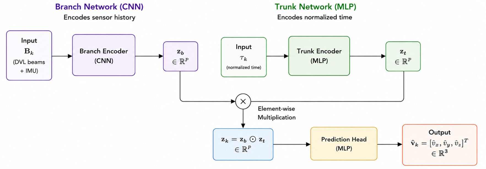
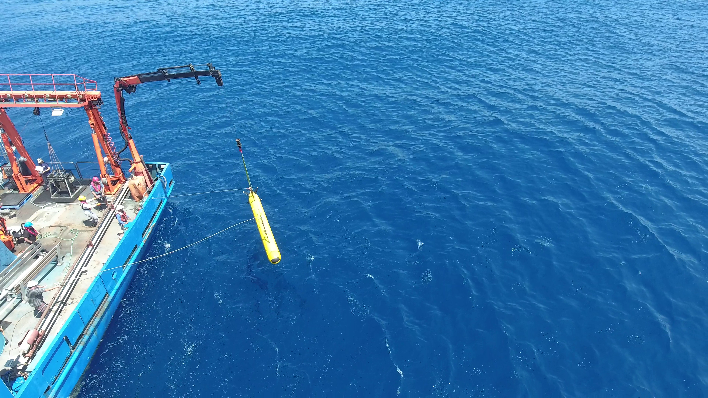

# DVL-DeepONet

[](https://arxiv.org/abs/2606.23502)

Official implementation of:

**DVL-DeepONet: A Physics-Guided Operator Learning for Resilient Underwater Navigation**

DVL-DeepONet is a physics-guided operator-learning framework for robust Doppler Velocity Log (DVL) velocity estimation in Autonomous Underwater Vehicles (AUVs). The framework integrates Deep Operator Networks with DVL measurement physics to provide velocity estimation of AUV under noisy measurements, DVL-only operation, and partial beam-outage conditions.

This repository contains three Jupyter notebook versions of DVL-DeepONet for estimating velocity vector from DVL measurements, with  baseline comparisons.

## Framework Overview

<p align="center">
  
</p>

<p align="center">
  <em>Architecture of the proposed DVL-DeepONet framework.</em>
</p>


## Key Contributions

1. A novel physics-guided DVL-DeepONet framework, uniquely designed to forecast DVL velocity vector.

2. Three complementary DVL-DeepONet architectures to address practical underwater navigation scenarios.

3. Extensive validation on AUV datasets collected from real-world sea trials and competitive baselines, demonstrating improved robustness, velocity estimation accuracy, and navigation performance.


## Experimental Platform

<p align="center">
  
</p>

<p align="center">
  <em>Snapir Autonomous Underwater Vehicle (AUV) used for data collection during Mediterranean Sea trials.</em>
</p>


## Results

| Model | VRMSE (m/s) | Best Gain |
|-----------|------------|------------|
| DVL-DeepONet-I | 0.105 | 18% |
| DVL-DeepONet-II | 0.096 | 68% |
| DVL-DeepONet-III | 0.114 | 92% |


## Files

- `main_DVL-DeepONet_I.ipynb`
  - Noise-resilient velocity estimation using DVL and IMU measurements.

- `main_DVL-DeepONet_II.ipynb`
  - DVL-only velocity estimation without inertial measurements.

- `main_DVL-DeepONet_III.ipynb`
  - Partial DVL beam recovery and velocity estimation under beam outages.


## Usage

Open any notebook in Jupyter Notebook, JupyterLab, or Google Colab and run the cells in order.

## Author

Arup Kumar Sahoo and Itzik Klein

## Citation

If you use this repository in your research, please cite:

```bibtex
@article{sahoo2026dvldeeponet,
  title={DVL-DeepONet: A Physics-Guided Operator Learning for Resilient Underwater Navigation},
  author={Sahoo, Arup Kumar and Klein, Itzik},
  journal={arXiv preprint arXiv:2606.23502},
  year={2026}
}
